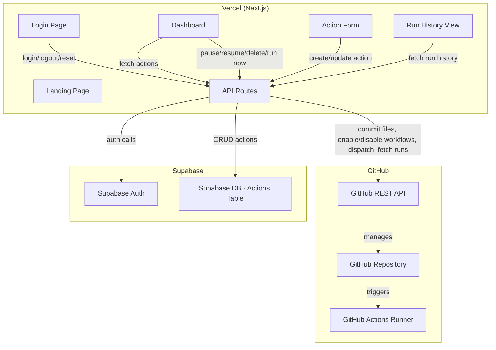

# Design Document: Cron Job Builder

## Overview

The Cron Job Builder is a single-admin web application for managing scheduled JavaScript actions. The admin configures actions (script + schedule) through a Next.js dashboard. The app generates GitHub Actions workflow YAML files and commits them alongside the scripts to a GitHub repository. GitHub Actions handles all execution. Run history is read from GitHub's workflow run API — no execution data is stored locally.

Key design decisions:
- **No direct client-to-external-service calls.** Every Supabase and GitHub API call is proxied through Next.js API routes, keeping tokens and credentials server-side only.
- **GitHub as the execution backend.** No custom runner infrastructure. GitHub Actions cron schedules drive execution; the app only manages configuration.
- **Run history is read-only from GitHub.** No separate run log table. The GitHub Actions API provides timestamps, statuses, and logs.
- **Single admin model.** Supabase Auth with no signup flow. The admin account is pre-provisioned.

## Architecture



### Request Flow

1. Client makes a request to a Next.js API route.
2. The API route authenticates the request using the Supabase session cookie.
3. The API route performs the operation (Supabase DB write, GitHub API call, or both).
4. For mutating operations (create/edit/delete), the GitHub commit happens first. If it fails, the Supabase write is skipped (GitHub-first transactional pattern).
5. The API route returns the result to the client.

### GitHub-First Transactional Pattern

For create, edit, and delete operations, the system must keep Supabase and GitHub in sync. The design uses a simple ordering guarantee:

1. **Commit to GitHub first.** If this fails, return an error immediately — Supabase is untouched.
2. **Write to Supabase second.** If this fails after a successful GitHub commit, the system is in an inconsistent state (GitHub has the file, Supabase doesn't know about it). This is an acceptable edge case for a single-admin tool — the admin can retry or manually clean up. A future improvement could add a reconciliation job.

This avoids the complexity of distributed transactions while providing a reasonable consistency guarantee for the common case.

## Components and Interfaces

### Pages (Next.js App Router)

| Route | Component | Auth Required | Description |
|---|---|---|---|
| `/` | `LandingPage` | No | Public feature showcase with CTA to login |
| `/login` | `LoginPage` | No | Email/password form, forgot password link |
| `/dashboard` | `DashboardPage` | Yes | Action cards grid, create button, empty state |
| `/dashboard/new` | `ActionFormPage` | Yes | Create action form |
| `/dashboard/[id]/edit` | `ActionFormPage` | Yes | Edit action form (pre-filled) |
| `/dashboard/[id]/history` | `RunHistoryPage` | Yes | Paginated run history with status filter |

### UI Components

| Component | Props | Description |
|---|---|---|
| `ActionCard` | `action: Action` | Displays name, day badges, status, toggle, run now, edit/delete controls |
| `DayBadge` | `day: string, active: boolean` | Single-letter day indicator with tooltip |
| `ScriptEditor` | `value: string, onChange` | Code editor for pasting JS, with file upload option |
| `SchedulePicker` | `schedule: Schedule, onChange` | Day checkboxes + time picker (H:M AM/PM) + timezone dropdown |
| `RunHistoryEntry` | `run: RunEntry` | Single row: timestamp, status badge, expandable output |
| `ConfirmDialog` | `message, onConfirm, onCancel` | Reusable confirmation modal for destructive actions |
| `GlassCard` | `children` | Wrapper applying glass-morphism styling |

### API Routes

| Route | Method | Description |
|---|---|---|
| `/api/auth/login` | POST | Authenticate admin via Supabase Auth |
| `/api/auth/logout` | POST | End session |
| `/api/auth/reset-password` | POST | Trigger Supabase password reset email |
| `/api/actions` | GET | List all actions from Supabase |
| `/api/actions` | POST | Create action (GitHub commit → Supabase insert) |
| `/api/actions/[id]` | GET | Get single action |
| `/api/actions/[id]` | PUT | Update action (GitHub commit → Supabase update) |
| `/api/actions/[id]` | DELETE | Delete action (GitHub delete → Supabase delete) |
| `/api/actions/[id]/toggle` | POST | Pause/resume (GitHub enable/disable workflow → Supabase status update) |
| `/api/actions/[id]/trigger` | POST | Manual run via GitHub workflow dispatch |
| `/api/actions/[id]/runs` | GET | Fetch run history from GitHub Actions API |

### Server-Side Modules

#### `GitHubBridge`

Encapsulates all GitHub REST API interactions. Used exclusively by API routes.

```typescript
interface GitHubBridge {
  commitScript(actionId: string, scriptContent: string): Promise<void>;
  commitWorkflow(actionId: string, workflowYaml: string): Promise<void>;
  deleteScript(actionId: string): Promise<void>;
  deleteWorkflow(actionId: string): Promise<void>;
  enableWorkflow(actionId: string): Promise<void>;
  disableWorkflow(actionId: string): Promise<void>;
  triggerWorkflow(actionId: string): Promise<void>;
  getWorkflowRuns(actionId: string, page: number, status?: string): Promise<RunEntry[]>;
}
```

File paths in the repository:
- Scripts: `scripts/{actionId}.js`
- Workflows: `.github/workflows/{actionId}.yml`

#### `WorkflowGenerator`

Generates GitHub Actions workflow YAML from an Action configuration.

```typescript
interface WorkflowGenerator {
  generate(action: Action): string;
  parseCronToSchedule(cronExpression: string): Schedule;
}
```

The `generate` function produces a YAML string containing:
- `on.schedule[].cron` — the cron expression derived from the action's days, time, and timezone
- `on.workflow_dispatch` — enables the "Run Now" feature
- `jobs.run.steps` — Node.js setup, dependency install (including Puppeteer), and script execution

The `parseCronToSchedule` function is the inverse: it takes a cron expression and returns the equivalent `Schedule` object. This enables round-trip verification.

#### `CronBuilder`

Converts a `Schedule` (days + time + timezone) into a cron expression and vice versa.

```typescript
interface CronBuilder {
  buildCron(schedule: Schedule): string;
  parseCron(cronExpression: string): Schedule;
}
```

GitHub Actions cron uses UTC. The `buildCron` function converts the admin's local time + timezone into the equivalent UTC cron expression. `parseCron` reverses this given a target timezone.


## Data Models

### Action (Supabase Table: `actions`)

| Column | Type | Description |
|---|---|---|
| `id` | `uuid` (PK) | Unique action identifier |
| `name` | `text` (NOT NULL) | Display name for the action |
| `script_content` | `text` (NOT NULL) | JavaScript source code |
| `days` | `smallint[]` (NOT NULL) | Array of day numbers (0=Sunday, 1=Monday, ..., 6=Saturday) |
| `time_hour` | `smallint` (NOT NULL) | Hour in 12-hour format (1–12) |
| `time_minute` | `smallint` (NOT NULL) | Minute (0–59) |
| `time_period` | `text` (NOT NULL) | "AM" or "PM" |
| `timezone` | `text` (NOT NULL) | IANA timezone string (e.g., "America/New_York") |
| `status` | `text` (NOT NULL, DEFAULT 'active') | "active" or "paused" |
| `github_workflow_id` | `bigint` | GitHub workflow ID for enable/disable/dispatch API calls |
| `created_at` | `timestamptz` (DEFAULT now()) | Creation timestamp |
| `updated_at` | `timestamptz` (DEFAULT now()) | Last update timestamp |

### Schedule (Application Type)

```typescript
interface Schedule {
  days: number[];        // 0=Sun, 1=Mon, ..., 6=Sat
  hour: number;          // 1–12
  minute: number;        // 0–59
  period: 'AM' | 'PM';
  timezone: string;      // IANA timezone
}
```

### RunEntry (from GitHub Actions API)

```typescript
interface RunEntry {
  id: number;
  status: 'success' | 'failure';
  timestamp: string;     // ISO 8601
  output: string;        // Log excerpt or error message
  trigger: 'schedule' | 'workflow_dispatch';
}
```

### Action (Application Type)

```typescript
interface Action {
  id: string;
  name: string;
  scriptContent: string;
  schedule: Schedule;
  status: 'active' | 'paused';
  githubWorkflowId?: number;
  createdAt: string;
  updatedAt: string;
}
```

### Environment Configuration

Server-side only (not exposed to client):

| Variable | Description |
|---|---|
| `SUPABASE_URL` | Supabase project URL |
| `SUPABASE_SERVICE_ROLE_KEY` | Supabase service role key for server-side operations |
| `NEXT_PUBLIC_SUPABASE_URL` | Supabase URL for client-side auth SDK |
| `NEXT_PUBLIC_SUPABASE_ANON_KEY` | Supabase anon key for client-side auth SDK |
| `GITHUB_REPO_OWNER` | GitHub repository owner |
| `GITHUB_REPO_NAME` | GitHub repository name |
| `GITHUB_PAT` | GitHub personal access token |

Note: `NEXT_PUBLIC_SUPABASE_URL` and `NEXT_PUBLIC_SUPABASE_ANON_KEY` are used by the Supabase client SDK for session management only. All sensitive operations (DB writes, GitHub calls) use server-side keys exclusively.


## Correctness Properties

*A property is a characteristic or behavior that should hold true across all valid executions of a system — essentially, a formal statement about what the system should do. Properties serve as the bridge between human-readable specifications and machine-verifiable correctness guarantees.*

### Property 1: Unauthenticated route protection

*For any* protected route (dashboard, action management, history) and any unauthenticated request, the application should redirect to the login page and never render protected content.

**Validates: Requirements 2.7**

### Property 2: Dashboard renders all actions with correct data

*For any* set of actions stored in the database, the dashboard should render exactly one action card per action, and each card should display the action's name, a day badge for each selected day, and the current status (active or paused).

**Validates: Requirements 3.1, 3.2**

### Property 3: Action creation persists to both stores

*For any* valid action configuration (non-empty name, non-empty script, at least one day selected, valid time, valid timezone), submitting the creation form should result in the action being stored in Supabase and the script + workflow files being committed to the GitHub repository.

**Validates: Requirements 4.6, 4.7**

### Property 4: Form validation rejects incomplete submissions

*For any* action creation or edit form submission where one or more required fields (name, script, days, time) are missing or empty, the application should display validation errors and not submit the form to the API.

**Validates: Requirements 4.8**

### Property 5: GitHub-first transactional guarantee

*For any* mutating operation (create, update, or delete) where the GitHub API call fails, the Supabase database should remain unchanged — no action should be created, updated, or deleted in Supabase.

**Validates: Requirements 4.9, 5.4, 6.4**

### Property 6: Edit form pre-fill correctness

*For any* existing action, opening the edit form should pre-fill all fields (name, script content, selected days, time, period, timezone) with values that exactly match the stored action configuration.

**Validates: Requirements 5.1**

### Property 7: Action update persists to both stores

*For any* valid action update, submitting the edit form should result in the updated configuration being stored in Supabase and the updated script + workflow files being committed to the GitHub repository.

**Validates: Requirements 5.2, 5.3**

### Property 8: Action deletion removes from both stores

*For any* action, confirming deletion should result in the action being removed from Supabase and the corresponding script + workflow files being deleted from the GitHub repository.

**Validates: Requirements 6.2, 6.3**

### Property 9: Pause/resume round-trip

*For any* active action, pausing and then resuming it should result in the action returning to active status in Supabase and the GitHub workflow being re-enabled — the action's state should be equivalent to its state before the pause.

**Validates: Requirements 7.2, 7.3, 7.4, 7.5**

### Property 10: Paused action visual indication

*For any* action with status "paused", the rendered action card should contain a visual indicator distinguishing it from active actions (e.g., a distinct CSS class, muted styling, or paused label).

**Validates: Requirements 7.6**

### Property 11: Manual trigger dispatches workflow

*For any* action with a valid GitHub workflow ID, clicking "Run Now" should invoke the GitHub workflow dispatch API for that workflow.

**Validates: Requirements 8.2**

### Property 12: Run history entries display required fields

*For any* run history entry returned from the GitHub Actions API, the rendered display should include the execution timestamp, status (success or failure), and execution output or error message.

**Validates: Requirements 9.1, 9.2**

### Property 13: Run history filter correctness

*For any* set of run history entries and any selected filter (all, success, fail), the displayed entries should be exactly those whose status matches the filter (or all entries when filter is "all").

**Validates: Requirements 9.4**

### Property 14: Generated workflow structure completeness

*For any* valid action configuration, the generated GitHub Actions workflow YAML should be valid YAML and should contain: (a) a `schedule` trigger with a cron expression, (b) a `workflow_dispatch` trigger, (c) a Node.js setup step, (d) a dependency installation step including Puppeteer, and (e) a script execution step referencing the correct script path.

**Validates: Requirements 10.1, 10.3, 10.4, 10.5, 13.1**

### Property 15: Schedule-to-cron round-trip

*For any* valid schedule (days, hour, minute, AM/PM, timezone), converting the schedule to a cron expression and then parsing that cron expression back (given the same timezone) should produce a schedule equivalent to the original.

**Validates: Requirements 10.2, 13.2**

### Property 16: Correct file paths in repository

*For any* action, the GitHub Bridge should commit the script file to `scripts/{actionId}.js` and the workflow file to `.github/workflows/{actionId}.yml`.

**Validates: Requirements 11.2, 11.3**

### Property 17: Invalid schedule rejection

*For any* action configuration with an invalid schedule (no days selected, hour outside 1–12, minute outside 0–59, invalid timezone, or invalid AM/PM value), the system should reject the configuration before attempting to generate a workflow file.

**Validates: Requirements 13.3**


## Error Handling

### Client-Side Errors

| Scenario | Handling |
|---|---|
| Form validation failure | Display inline field-level errors. Do not submit to API. |
| API route returns 401 | Redirect to login page. Clear local session state. |
| API route returns 4xx/5xx | Display toast notification with error message from response body. |
| Network failure | Display toast notification indicating connectivity issue. Suggest retry. |

### API Route Errors

| Scenario | Handling |
|---|---|
| Supabase auth failure | Return 401 with `{ error: "Authentication failed" }` |
| Supabase DB error | Return 500 with `{ error: "Database error" }`. Log details server-side. |
| GitHub API failure (commit/delete/enable/disable/dispatch) | Return 502 with `{ error: "GitHub operation failed", details: ... }`. Do not proceed with Supabase write. |
| GitHub API rate limit | Return 429 with `{ error: "GitHub rate limit exceeded" }`. Include `Retry-After` if available. |
| Invalid action configuration | Return 400 with `{ error: "Validation failed", fields: [...] }` |
| GitHub repo inaccessible / invalid token | Return 502 with `{ error: "GitHub connection failed" }`. Surface on dashboard as a persistent banner. |

### Transactional Error Recovery

As described in the Architecture section, the GitHub-first pattern means:
- **GitHub fails → Supabase untouched.** Clean failure, no inconsistency.
- **GitHub succeeds, Supabase fails → Inconsistent state.** The GitHub repo has files that Supabase doesn't know about. For a single-admin tool, this is acceptable. The API route should return an error indicating partial failure so the admin can retry. A future enhancement could add a reconciliation endpoint that scans the GitHub repo and syncs with Supabase.

## Testing Strategy

### Testing Framework

- **Unit & Integration Tests:** Vitest (fast, native ESM support, works well with Next.js)
- **Property-Based Tests:** fast-check (the standard PBT library for TypeScript/JavaScript)
- **Component Tests:** React Testing Library (for UI component rendering verification)
- **E2E Tests (optional, manual):** Playwright for full browser flows

### Unit Tests

Unit tests cover specific examples, edge cases, and integration points:

- `CronBuilder.buildCron` with known schedule → expected cron string
- `CronBuilder.parseCron` with known cron string → expected schedule
- `WorkflowGenerator.generate` with a specific action → expected YAML structure
- Schedule validation: edge cases like hour=0, hour=13, empty days array, invalid timezone
- API route auth guard: mock unauthenticated request → 401 response
- GitHub-first pattern: mock GitHub failure → verify Supabase not called
- Run history pagination: mock GitHub API response → verify correct page slicing
- Filter logic: specific run entries with mixed statuses → verify filter output

### Property-Based Tests

Each property test uses fast-check with a minimum of 100 iterations. Each test references its design property.

| Test | Property | Iterations |
|---|---|---|
| Auth guard redirects all protected routes | Property 1 | 100 |
| Dashboard renders correct cards for any action set | Property 2 | 100 |
| Valid action creation persists to both stores | Property 3 | 100 |
| Missing fields produce validation errors | Property 4 | 100 |
| GitHub failure prevents Supabase mutation | Property 5 | 100 |
| Edit form pre-fills match stored action | Property 6 | 100 |
| Valid action update persists to both stores | Property 7 | 100 |
| Action deletion removes from both stores | Property 8 | 100 |
| Pause then resume restores original state | Property 9 | 100 |
| Paused actions have visual indicator | Property 10 | 100 |
| Run Now dispatches workflow | Property 11 | 100 |
| Run history entries contain required fields | Property 12 | 100 |
| Run history filter returns matching entries | Property 13 | 100 |
| Generated workflow YAML is valid and complete | Property 14 | 100 |
| Schedule → cron → schedule round-trip | Property 15 | 100 |
| File paths follow naming convention | Property 16 | 100 |
| Invalid schedules are rejected | Property 17 | 100 |

Each property-based test must include a comment tag in the format:
```
// Feature: cron-job-builder, Property {number}: {property title}
```

### Test Organization

```
tests/
  unit/
    cron-builder.test.ts
    workflow-generator.test.ts
    schedule-validator.test.ts
    api-routes/
      actions.test.ts
      auth.test.ts
  property/
    auth-guard.property.test.ts
    dashboard-rendering.property.test.ts
    action-crud.property.test.ts
    pause-resume.property.test.ts
    run-history.property.test.ts
    workflow-generation.property.test.ts
    schedule-roundtrip.property.test.ts
    validation.property.test.ts
  components/
    action-card.test.tsx
    schedule-picker.test.tsx
    run-history-entry.test.tsx
```

### Key Generators (fast-check)

Property tests require custom generators for domain types:

- **`arbitrarySchedule`**: Generates valid `Schedule` objects (1–7 days from [0..6], hour 1–12, minute 0–59, AM/PM, timezone from a curated list of IANA zones)
- **`arbitraryAction`**: Generates valid `Action` objects (non-empty name, non-empty script, valid schedule, active/paused status)
- **`arbitraryInvalidSchedule`**: Generates invalid schedules (empty days, out-of-range hour/minute, invalid timezone)
- **`arbitraryRunEntry`**: Generates `RunEntry` objects with random timestamps, statuses, and output strings

