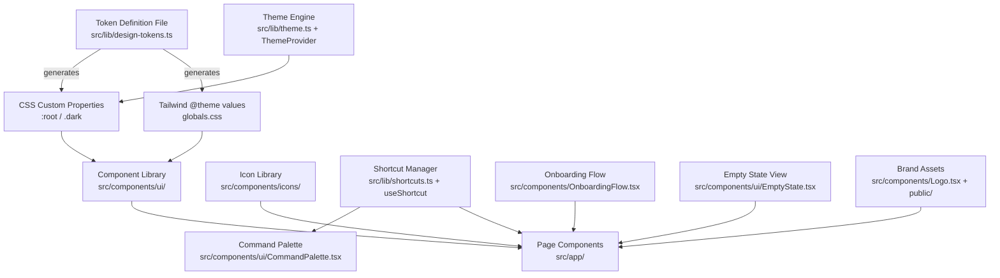

# Design Document: Design System & Branding for xCron

## Overview

This design establishes a unified design system and brand identity for xCron. The current codebase uses ad-hoc Tailwind classes with hardcoded color values in `globals.css` (`:root` CSS custom properties) and inline SVG icons scattered across components. There is no dark mode, no keyboard-driven navigation, no onboarding, and no formal component library.

The design introduces:

1. A centralized **design token system** that replaces scattered CSS variables with a structured token definition file, exposed via `:root` custom properties and Tailwind v4 `@theme` directives for both light and dark modes.
2. A **custom icon library** of 23+ SVG icon components with consistent API (`size`, `color`, `className`, `accessibleLabel`), replacing the ~30 inline SVGs currently embedded in page components.
3. **Brand assets** — an SVG logo component (light/dark variants), favicon (ICO 32×32), apple-touch-icon (PNG 180×180), and OG image (PNG 1200×630), wired into Next.js Metadata API.
4. A **dark mode theme engine** with three modes (light/dark/system), localStorage persistence, flash-free hydration via a blocking `<script>`, and `prefers-color-scheme` media query listener.
5. A **command palette** (Cmd+K / Ctrl+K) with fuzzy search, keyboard navigation, focus trapping, and context-aware shortcut suppression when editors/inputs are focused.
6. A **global keyboard shortcut manager** with a `useShortcut` hook, single-key suppression in editable contexts, and sub-50ms dispatch.
7. A **guided onboarding flow** for first-time users with template selection, localStorage completion flag, and skip capability.
8. **Empty state components** with themed SVG illustrations and contextual CTAs.
9. A **mobile-responsive dashboard layout** with breakpoint-driven grid (1/2/3 columns), collapsible stats bar, compact header, and bottom-sheet command palette on mobile.
10. A **component library foundation** of token-aware primitives: Button, Input, Select, Badge, Card, and Modal.


## Architecture

The design system is layered as follows:



### Key Architectural Decisions

1. **Token-first approach**: All visual values flow from a single TypeScript token definition file (`src/lib/design-tokens.ts`). This file exports structured objects for colors, spacing, typography, radii, and shadows. The `globals.css` file consumes these via CSS custom properties on `:root` and `.dark`, and the `@theme` directive maps them into Tailwind utilities. This means changing a token value in one place propagates everywhere.

2. **No runtime theme context for tokens**: Tokens are delivered via CSS custom properties, not React context. This avoids unnecessary re-renders when the theme changes — the browser handles the swap natively when the `dark` class toggles on `<html>`. The `ThemeProvider` only manages the mode preference (light/dark/system) and the class toggle.

3. **Icon library as individual named exports**: Each icon is a standalone component in `src/components/icons/index.ts` (barrel export). This enables tree-shaking — unused icons are excluded from the bundle. No external icon library dependency.

4. **Shortcut manager as a hook + module**: The `useShortcut` hook registers/deregisters handlers on mount/unmount. A central `ShortcutManager` module tracks active shortcuts and handles focus-context suppression (checking `document.activeElement` against input/textarea/contenteditable/CodeMirror elements).

5. **Command palette as a standalone modal component**: It consumes a static command registry plus dynamic action search results. Fuzzy matching uses a simple scoring algorithm (no external dependency like fuse.js) to keep the bundle small.

6. **Onboarding as a conditional overlay on the dashboard**: Rendered inside the dashboard page component, gated by `localStorage.getItem("xcron-onboarding-complete")` and the action count being zero.

7. **Mobile responsiveness via Tailwind breakpoints**: No CSS-in-JS media query hooks. The dashboard grid uses `grid-cols-1 sm:grid-cols-2 lg:grid-cols-3`. The command palette switches to a bottom sheet below 640px using a `sm:` breakpoint check via a `useMediaQuery` hook (only for the palette positioning).


## Components and Interfaces

### 1. Design Token Provider (`src/lib/design-tokens.ts`)

```typescript
// Token definition structure
export interface ColorScale {
  50: string; 100: string; 200: string; 300: string; 400: string;
  500: string; 600: string; 700: string; 800: string; 900: string; 950: string;
}

export interface TokenSet {
  colors: {
    primary: ColorScale;
    secondary: ColorScale;
    accent: ColorScale;
    success: ColorScale;
    warning: ColorScale;
    error: ColorScale;
    surface: { bg: string; bgSecondary: string; bgTertiary: string };
    neutral: ColorScale;
  };
  spacing: Record<string, string>; // "0" -> "0px", "1" -> "4px", ..., "96" -> "384px"
  typography: {
    fontFamilies: { sans: string; mono: string };
    fontSizes: Record<string, [string, string]>; // [fontSize, lineHeight]
    fontWeights: Record<string, number>;
  };
  radii: { sm: string; md: string; lg: string; xl: string; "2xl": string; full: string };
  shadows: { sm: string; md: string; lg: string; xl: string };
}

export const lightTokens: TokenSet;
export const darkTokens: TokenSet;

// Generates CSS custom property declarations from a TokenSet
export function tokensToCssProperties(tokens: TokenSet): Record<string, string>;

// Parses a token name string (e.g., "color-primary-500") and formats it back
export function parseTokenName(name: string): { category: string; path: string[] };
export function formatTokenName(parsed: { category: string; path: string[] }): string;
```

### 2. Theme Engine (`src/lib/theme.ts` + `src/components/ThemeProvider.tsx`)

```typescript
export type ThemeMode = "light" | "dark" | "system";

// Pure functions for theme logic
export function resolveTheme(mode: ThemeMode, systemPrefersDark: boolean): "light" | "dark";
export function getPersistedTheme(): ThemeMode;
export function persistTheme(mode: ThemeMode): void;

// React context provider
interface ThemeContextValue {
  mode: ThemeMode;
  resolved: "light" | "dark";
  setMode: (mode: ThemeMode) => void;
}
```

The `ThemeProvider` wraps the app in `layout.tsx`. A blocking inline `<script>` in `<head>` reads localStorage and sets the `dark` class before first paint.


### 3. Icon Library (`src/components/icons/`)

```typescript
export interface IconProps {
  size?: number;          // default: 20
  color?: string;         // default: "currentColor"
  className?: string;
  accessibleLabel?: string; // when provided, sets role="img" + aria-label
}

// Each icon is a named export:
export function ClockIcon(props: IconProps): JSX.Element;
export function CalendarIcon(props: IconProps): JSX.Element;
export function PlayIcon(props: IconProps): JSX.Element;
// ... (23+ icons total)
```

All icons render `<svg>` with `viewBox="0 0 24 24"`, `width={size}`, `height={size}`, `fill="none"`, `stroke={color}`. By default they have `aria-hidden="true"`. When `accessibleLabel` is provided, they get `role="img"` and `aria-label={accessibleLabel}` instead.

### 4. Brand Assets (`src/components/Logo.tsx` + `public/`)

```typescript
interface LogoProps {
  variant?: "light" | "dark"; // background context
  showWordmark?: boolean;
  className?: string;
}

export function Logo(props: LogoProps): JSX.Element;
```

Static assets:
- `public/favicon.ico` — 32×32 ICO
- `public/apple-touch-icon.png` — 180×180 PNG
- `public/og-image.png` — 1200×630 PNG

Metadata wired in `src/app/layout.tsx` via Next.js Metadata API.

### 5. Command Palette (`src/components/ui/CommandPalette.tsx`)

```typescript
interface Command {
  id: string;
  label: string;
  icon?: React.ReactNode;
  shortcut?: string;       // display hint, e.g., "T"
  action: () => void;
  category: "navigation" | "action" | "settings";
}

interface CommandPaletteProps {
  open: boolean;
  onClose: () => void;
  commands: Command[];
  actions?: Action[];      // for searching user actions by name
}
```

Fuzzy matching: scores each command label against the query using a character-by-character sequential match with gap penalty. Results sorted by score descending. Filtering completes within a single animation frame (<16ms for typical command lists).

### 6. Shortcut Manager (`src/lib/shortcuts.ts`)

```typescript
interface ShortcutOptions {
  /** If true, shortcut fires even when an input is focused */
  ignoreInputFocus?: boolean;
  /** If true, calls event.preventDefault() */
  preventDefault?: boolean;
}

export function useShortcut(
  key: string,                    // e.g., "k", "n", "t", "Escape"
  handler: (e: KeyboardEvent) => void,
  options?: ShortcutOptions & { meta?: boolean }
): void;

// Internal: checks if the active element is an editable field
export function isEditableElement(el: Element | null): boolean;
```


### 7. Onboarding Flow (`src/components/OnboardingFlow.tsx`)

```typescript
interface ActionTemplate {
  id: string;
  name: string;
  description: string;
  scriptContent: string;
  schedule: Schedule;
}

interface OnboardingFlowProps {
  onSelectTemplate: (template: ActionTemplate) => void;
  onDismiss: () => void;
}

export const ACTION_TEMPLATES: ActionTemplate[];

// Persistence helpers
export function isOnboardingComplete(): boolean;
export function markOnboardingComplete(): void;
```

Templates provided:
1. "Health Check Ping" — `fetch("https://example.com/health")` on weekdays at 9 AM
2. "Database Backup" — backup script daily at 2 AM
3. "Daily Report" — report generation on weekdays at 8 AM

### 8. Empty State View (`src/components/ui/EmptyState.tsx`)

```typescript
interface EmptyStateProps {
  illustration: "no-actions" | "no-runs";
  heading: string;
  description: string;
  action?: { label: string; onClick: () => void };
}
```

Illustrations are inline SVGs that use `currentColor` and CSS custom properties to respect the active theme. Each SVG has `role="img"` and `aria-label`.

### 9. Component Library Primitives (`src/components/ui/`)

```typescript
// Button
interface ButtonProps extends React.ButtonHTMLAttributes<HTMLButtonElement> {
  variant?: "primary" | "secondary" | "ghost" | "danger";
  size?: "sm" | "md" | "lg";
  loading?: boolean;
}

// Input
interface InputProps extends React.InputHTMLAttributes<HTMLInputElement> {
  error?: string;
  label?: string;
}

// Select
interface SelectProps extends React.SelectHTMLAttributes<HTMLSelectElement> {
  options: { value: string; label: string }[];
  error?: string;
  label?: string;
}

// Badge
interface BadgeProps {
  variant?: "success" | "warning" | "error" | "neutral";
  children: React.ReactNode;
  className?: string;
}

// Card
interface CardProps {
  children: React.ReactNode;
  className?: string;
  padding?: "sm" | "md" | "lg";
}

// Modal
interface ModalProps {
  open: boolean;
  onClose: () => void;
  title?: string;
  children: React.ReactNode;
  triggerRef?: React.RefObject<HTMLElement>;
}
```

The Modal component traps focus (Tab/Shift+Tab cycling), closes on Escape, closes on backdrop click, and restores focus to `triggerRef` on close.


## Data Models

No new database tables are required. All new state is client-side:

| Data | Storage | Key | Shape |
|------|---------|-----|-------|
| Theme preference | `localStorage` | `xcron-theme` | `"light" \| "dark" \| "system"` |
| Onboarding completion | `localStorage` | `xcron-onboarding-complete` | `"true"` (presence = complete) |
| Command palette state | React state | — | `{ open: boolean; query: string; selectedIndex: number }` |
| Shortcut registry | Module-level Map | — | `Map<string, { handler: Function; options: ShortcutOptions }>` |

### Token Definition File Structure

The token definition file (`src/lib/design-tokens.ts`) is the single source of truth. It exports:

- `lightTokens: TokenSet` — full token set for light mode
- `darkTokens: TokenSet` — full token set for dark mode
- `tokensToCssProperties(tokens)` — converts a `TokenSet` into a flat `Record<string, string>` of CSS custom property name → value pairs (e.g., `"--color-primary-500": "#7c3aed"`)
- `parseTokenName(name)` / `formatTokenName(parsed)` — round-trip token name parsing for tooling and validation

The `globals.css` file references these tokens via CSS custom properties:

```css
:root {
  --color-primary-500: #7c3aed;
  /* ... all light tokens ... */
}

.dark {
  --color-primary-500: #a78bfa;
  /* ... all dark tokens ... */
}

@theme inline {
  --color-primary: var(--color-primary-500);
  --color-accent: var(--color-accent-500);
  /* ... mapped to Tailwind utilities ... */
}
```

### Existing Types (unchanged)

The existing `Action`, `Schedule`, and `RunEntry` types in `src/types/index.ts` remain unchanged. The onboarding templates reuse the `Schedule` type for pre-filled values.


## Correctness Properties

*A property is a characteristic or behavior that should hold true across all valid executions of a system — essentially, a formal statement about what the system should do. Properties serve as the bridge between human-readable specifications and machine-verifiable correctness guarantees.*

### Property 1: Token name round-trip

*For any* valid token name string (e.g., `"color-primary-500"`, `"spacing-4"`, `"radius-lg"`), calling `parseTokenName` then `formatTokenName` on the result should produce the original token name string.

**Validates: Requirements 1.5**

### Property 2: Token sets structural parity

*For any* key path that exists in `lightTokens`, the same key path should exist in `darkTokens` with a non-empty value, and vice versa. Both token sets should contain all required categories (colors, spacing, typography, radii, shadows) with all expected sub-keys.

**Validates: Requirements 1.1, 1.4**

### Property 3: Token-to-CSS property generation

*For any* `TokenSet`, calling `tokensToCssProperties` should produce a `Record<string, string>` where every key starts with `"--"` and every value is a non-empty string. The number of generated properties should equal the total number of leaf values in the token set.

**Validates: Requirements 1.2**

### Property 4: Icon rendering consistency

*For any* icon in the Icon Library and *for any* valid `size` (positive number) and `color` string, the rendered SVG element should have `width` and `height` equal to `size`, `viewBox` equal to `"0 0 24 24"`, and `stroke` equal to `color`.

**Validates: Requirements 2.2, 2.5**

### Property 5: Icon accessibility attributes

*For any* icon in the Icon Library, when rendered without an `accessibleLabel` prop, the SVG should have `aria-hidden="true"`. When rendered with a non-empty `accessibleLabel` string, the SVG should have `role="img"` and `aria-label` equal to the provided label, and should not have `aria-hidden`.

**Validates: Requirements 2.3, 2.4**


### Property 6: Theme persistence round-trip

*For any* valid `ThemeMode` value (`"light"`, `"dark"`, or `"system"`), calling `persistTheme(mode)` then `getPersistedTheme()` should return the original mode value.

**Validates: Requirements 4.2**

### Property 7: Theme mode round-trip (light → dark → light)

*For any* initial resolved theme state produced by `resolveTheme("light", systemPrefersDark)`, applying `resolveTheme("dark", systemPrefersDark)` then `resolveTheme("light", systemPrefersDark)` should produce a result identical to the initial light state.

**Validates: Requirements 4.7**

### Property 8: Fuzzy match correctness

*For any* query string and *for any* list of command labels, the fuzzy match filter should return only commands whose label contains all characters of the query in sequential order (not necessarily contiguous). Commands not matching should be excluded.

**Validates: Requirements 5.3**

### Property 9: Command palette keyboard navigation bounds

*For any* list of N commands (N > 0) and *for any* sequence of ArrowUp and ArrowDown key presses, the selected index should always remain within the range [0, N-1], wrapping or clamping at boundaries.

**Validates: Requirements 5.6**

### Property 10: Editable element shortcut suppression

*For any* element that is an `<input>`, `<textarea>`, `<select>`, `[contenteditable]`, or a CodeMirror editor, `isEditableElement` should return `true`, and single-key shortcuts (N, T) should be suppressed. *For any* element that is none of these types, `isEditableElement` should return `false`.

**Validates: Requirements 5.7, 6.2**

### Property 11: Onboarding templates validity

*For any* template in the `ACTION_TEMPLATES` array, the template should have a non-empty `name`, non-empty `description`, non-empty `scriptContent`, and a `schedule` with at least one day selected, `hour` between 1-12, `minute` between 0-59, and a valid `period` ("AM" or "PM").

**Validates: Requirements 7.2**

### Property 12: Onboarding completion persistence round-trip

*For any* sequence of calls, after calling `markOnboardingComplete()`, calling `isOnboardingComplete()` should return `true`.

**Validates: Requirements 7.4**

### Property 13: Empty state rendering completeness

*For any* valid `EmptyStateProps` (any `illustration` type, any non-empty `heading` and `description` strings, and any optional `action`), the rendered output should contain the heading text, the description text, and the illustration SVG should have `role="img"` and a non-empty `aria-label`.

**Validates: Requirements 8.3, 8.5**

### Property 14: Button variant and size rendering

*For any* combination of Button `variant` ("primary", "secondary", "ghost", "danger"), `size` ("sm", "md", "lg"), `loading` (boolean), and `disabled` (boolean), the Button component should render without error and produce a `<button>` element with the correct `disabled` attribute when `disabled` or `loading` is true.

**Validates: Requirements 10.3**

### Property 15: Input error display

*For any* non-empty `error` string, the Input component should render the error text visible in its output. *For any* empty or undefined `error`, no error message element should be present.

**Validates: Requirements 10.5**

### Property 16: Component rendering idempotence

*For any* component in the library (Button, Input, Select, Badge, Card) and *for any* valid set of props, rendering the component twice with the same props should produce identical DOM output.

**Validates: Requirements 10.6**


## Error Handling

### Theme Engine
- If `localStorage` is unavailable (private browsing, storage quota), the Theme Engine falls back to `"system"` mode and does not throw. `persistTheme` silently no-ops.
- If the `prefers-color-scheme` media query is unsupported, the Theme Engine defaults to light mode.

### Command Palette
- If the fuzzy match produces zero results, the palette displays a "No results found" message.
- If a command's `action` handler throws, the error is caught and a toast notification is shown. The palette still closes.

### Shortcut Manager
- If `useShortcut` is called with a key that conflicts with an already-registered shortcut at the same scope, the newer registration takes precedence (last-in wins). A console warning is emitted in development.
- If `document.activeElement` is null (e.g., during SSR), `isEditableElement` returns `false`.

### Onboarding Flow
- If `localStorage` is unavailable, the onboarding flow shows on every visit (no persistence). It does not throw.
- If the template data is malformed (defensive), the "Get Started" button is disabled with a tooltip explaining the issue.

### Icon Library
- If an invalid `size` (≤ 0 or NaN) is passed, the icon defaults to `size=20`.
- If `color` is an empty string, it defaults to `"currentColor"`.

### Component Library
- The Modal component handles the case where `triggerRef.current` is null on close (e.g., trigger was unmounted) by not attempting to restore focus.
- The Input component sanitizes the `error` prop by trimming whitespace. An all-whitespace error is treated as no error.

## Testing Strategy

### Testing Framework

- **Unit & property tests**: Vitest (already configured in `vitest.config.ts`)
- **Property-based testing library**: fast-check (already installed, `^4.6.0`)
- **Component testing**: `@testing-library/react` + `jsdom` (already configured)

### Property-Based Tests

Each correctness property from the design document maps to a single property-based test using `fast-check`. Tests are located in `tests/property/` and follow the naming convention `{feature-area}.property.test.ts`.

Configuration:
- Minimum 100 iterations per property test (`{ numRuns: 100 }`)
- Each test is tagged with a comment referencing the design property

Tag format: `Feature: design-system-branding, Property {N}: {title}`

Planned property test files:

| File | Properties Covered |
|------|--------------------|
| `tests/property/design-tokens.property.test.ts` | 1, 2, 3 |
| `tests/property/icon-library.property.test.ts` | 4, 5 |
| `tests/property/theme-engine.property.test.ts` | 6, 7 |
| `tests/property/command-palette.property.test.ts` | 8, 9 |
| `tests/property/shortcut-manager.property.test.ts` | 10 |
| `tests/property/onboarding.property.test.ts` | 11, 12 |
| `tests/property/empty-state.property.test.ts` | 13 |
| `tests/property/component-library.property.test.ts` | 14, 15, 16 |

### Unit Tests

Unit tests complement property tests by covering specific examples, edge cases, and integration points:

- **Brand assets**: Verify Logo component renders SVG for both variants, metadata includes favicon/OG references
- **Dark mode**: Verify blocking script sets `dark` class, system preference listener fires
- **Command palette**: Verify Cmd+K opens, Escape closes, focus trap works, command execution
- **Keyboard shortcuts**: Verify specific shortcuts (N, T, Escape) trigger correct handlers
- **Onboarding**: Verify conditional rendering based on action count and localStorage flag
- **Empty states**: Verify dashboard empty state and run history empty state render correctly
- **Mobile responsive**: Verify grid class changes at breakpoints, compact header rendering
- **Modal**: Verify focus trap, Escape close, backdrop click close, focus restoration

### Test Organization

```
tests/
├── property/
│   ├── design-tokens.property.test.ts
│   ├── icon-library.property.test.ts
│   ├── theme-engine.property.test.ts
│   ├── command-palette.property.test.ts
│   ├── shortcut-manager.property.test.ts
│   ├── onboarding.property.test.ts
│   ├── empty-state.property.test.ts
│   └── component-library.property.test.ts
├── components/
│   ├── command-palette.test.tsx
│   ├── onboarding-flow.test.tsx
│   ├── empty-state.test.tsx
│   ├── modal.test.tsx
│   └── logo.test.tsx
└── unit/
    ├── theme-engine.test.ts
    ├── shortcut-manager.test.ts
    └── brand-metadata.test.ts
```

